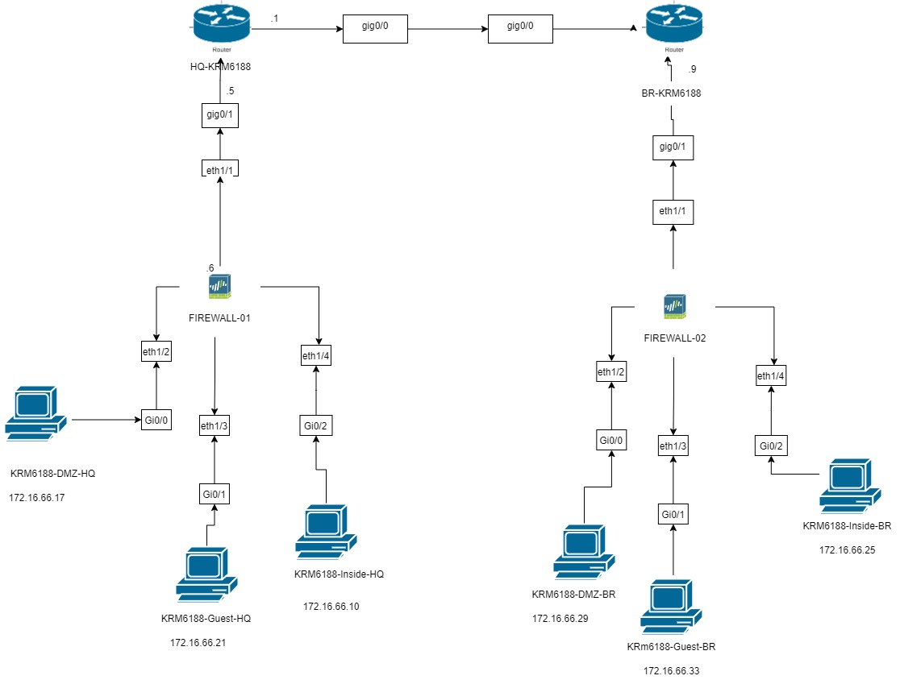
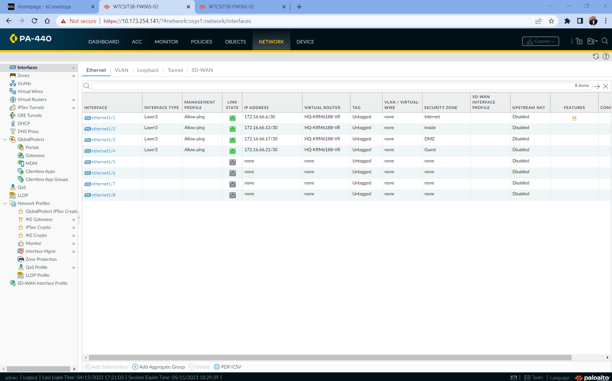
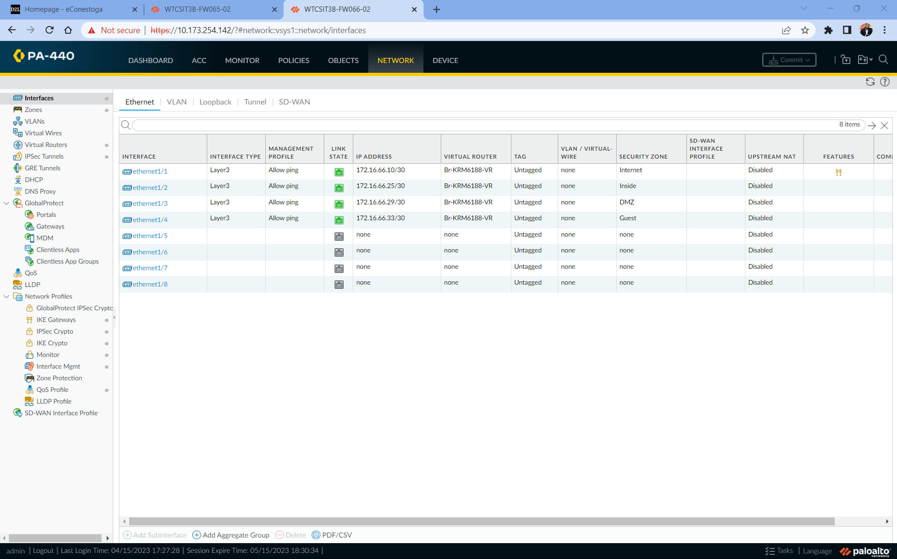
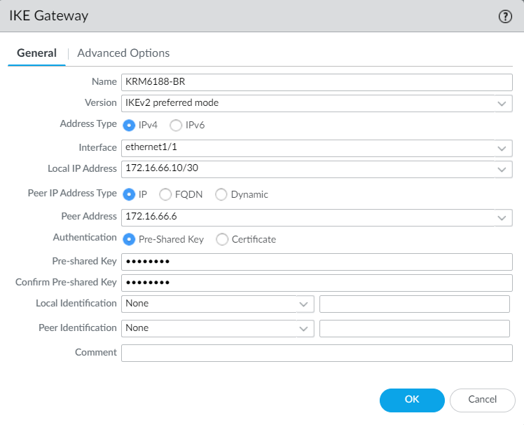
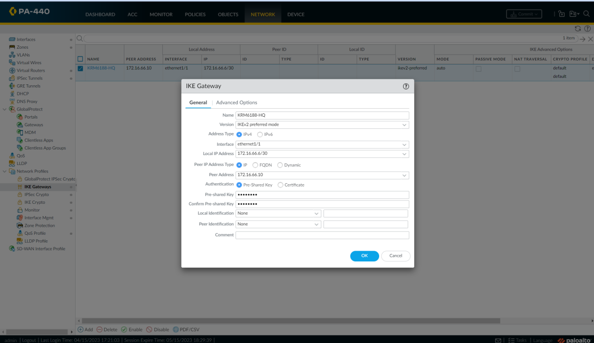
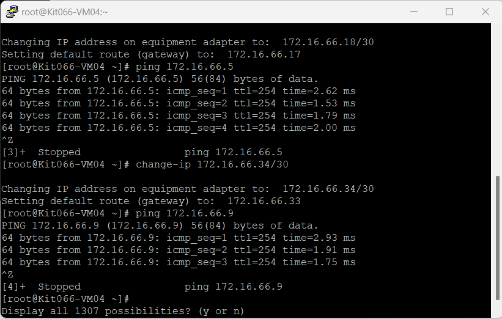
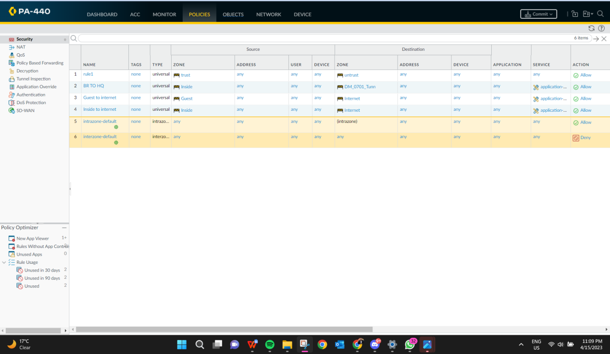
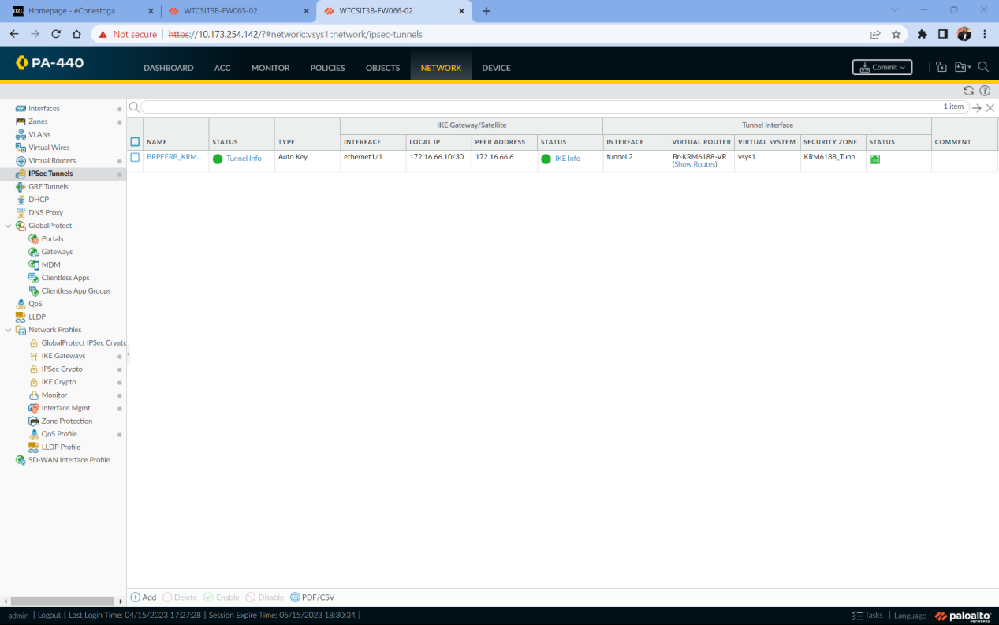

# Site-to-Site-VPN-Firewall-Project
Site-to-site VPN with Palo Alto Firewalls | IPsec Tunnel | Security Zones | NAT | Policy Implementation
=======
# 🔐 Site-to-Site VPN Firewall Project 

This project demonstrates how to configure a secure Site-to-Site VPN using **Palo Alto Firewalls**, IPsec Tunnels, NAT, and Security Zones across two networks (HQ & Branch).

---

## 🗺️ Topology Summary

- 🔸 HQ & Branch sites connected via VPN IPsec tunnel
- 🔸 Palo Alto Firewall configured with multiple security zones:
  - Inside
  - DMZ
  - Guest
  - Internet
- 🔸 NAT translation for outbound access
- 🔸 Tunnel interfaces created and assigned to zones
- 🔸 IKE Phase 1 & 2 encryption configured

---

## 🔧 Tools Used

- 🧱 Cisco Routers & Switches
- 🖥️ 5 Virtual Machines
- 🔥 Palo Alto Firewalls
- 🛠️ Putty for CLI Configuration

---

## 🧠 Key Concepts Practiced

- Virtual Router Configuration
- Static Routing (CLI & GUI)
- IPsec Tunnel Setup
- IKE Crypto Profile Configuration
- Firewall NAT & Security Policy
- Guest & DMZ Isolation
- VPN Connectivity Testing (CLI)

---

## 📂 Project Screenshots

### 🔹 Network Topology Diagram

### 🔹 HQ Firewall Interface Configuration

### 🔹 Branch Firewall Interface Configuration

### 🔹 HQ IKE Gateway Settings

### 🔹 BR IKE Gateway Settings

### 🔹 IPsec Tunnel Setup

### 🔹 Security Policies (HQ)

### 🔹 Security Policies (BR)

### 🔹 Packet Tracer Output

---
## ✅ Key Highlights
- Configured secure IPSEC tunnel between two remote networks.
- Verified interconnectivity with successful ICMP responses.
- Customized firewall rules to allow encrypted communication only.
- Learned real-world practices for secure remote access between two LANs.

## 🧩 Reflection

This project helped me understand how to design and deploy a secure site-to-site VPN connection using real-world enterprise firewall features like IPsec, NAT, zone-based segmentation, and routing.

---

## 🙋‍♂️ I'm a Cybersecurity graduate passionate about firewall technologies, network security, and cloud architecture. Connect with me on [LinkedIn](https://www.linkedin.com/in/kabileshar) or explore my [GitHub profile](https://github.com/kabileshar) for more labs and learning!
